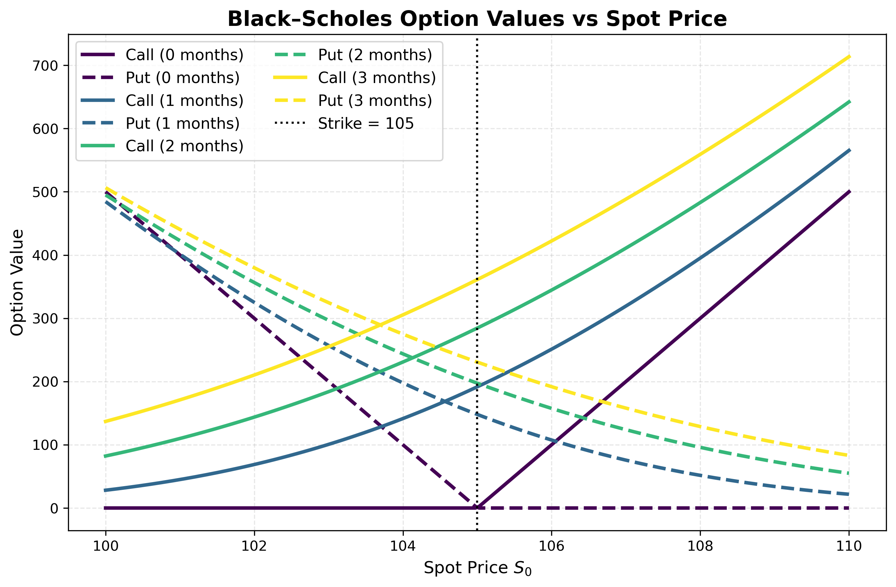

# price_models

A Python framework for modeling stock behavior and pricing options, including analytical models, risk sensitivities, probability analysis, and Monte Carlo simulations.

## Features

- **Stock Price Models**
  - Tools for probability density functions, mean, variance, weighted integrals, and confidence intervals
  - Monte Carlo simulation of stock price paths
  - Probability of touch (POT)

- **Option Pricing Models**
  - Valuation of options according to the chosen pricing model
  - Black–Scholes implementation with Greeks (Delta, Gamma, Vega, Theta, Rho)
  - Support for contract sizing and payoff logic at maturity

## Examples

For more detailed examples, go to `examples`.

### Stock Price Densities
Comparison of the parametric GBM density vs empirical-based density:

### Stock Price Simulated Paths
Monte Carlo paths from a GBM model compared with empirical paths:

### Black–Scholes Option Valuation
Option values vs. spot price for calls and puts across maturities, according to Black-Scholes model:

We also illustrate our `NoArbitrageModel` class, that given any stock pricing model, it computes option prices in an arbitrage-free way:

